# ModelDirector



**Open-source, stateless AI model selection engine.**

Instead of hardcoding a model choice, ModelDirector scores a user prompt
against a configurable set of candidate models and returns the **cheapest
capable** pick, with a full reasoning trace.

> "Which model should handle this request?"

ModelDirector doesn't execute prompts and isn't a gateway. It just
**decides**, and the decision is auditable, deterministic, and explainable.

```bash
$ echo "Translate 'hello' to Spanish." | modeldirector select -c config.yaml
{
  "selected_model": "cheap",
  "policy": "cheapest_capable",
  "scores": {
    "cheap":    { "overall": 92, "reasoning": 80, "coding": 85, "context": 90, ... },
    "mid":      { "overall": 95, "reasoning": 90, "coding": 92, "context": 95, ... },
    "premium":  { "overall": 99, "reasoning": 99, "coding": 97, "context": 99, ... }
  },
  "reason": "'cheap' is the first model exceeding the threshold of 80 (overall=92, priority=1, cost=1)."
}
```

---

## Why

Most agents ship with a single hardcoded model. Two problems:

1. **Cost** — using Opus for a typo-fix is wasteful.
2. **Lock-in** — switching providers means rewriting call sites.

ModelDirector sits *before* the model call. The same `director.select(prompt)`
call works for OpenAI, Anthropic, local Ollama, or a self-hosted mix.
The selection is auditable (`reason`), deterministic (configurable seed), and
explainable (full per-model scores).

---

## Install

```bash
# Core (SDK + CLI)
pip install modeldirector

# With REST adapter
pip install "modeldirector[rest]"

# With MCP adapter (for Claude Desktop, Continue, etc.)
pip install "modeldirector[mcp]"

# Everything
pip install "modeldirector[all]"
```

Or from this repo:

```bash
git clone https://github.com/aniketkarne-com/ModelDirector
cd ModelDirector
uv sync --all-extras
```

---

## Quickstart

1. **Write a config** (`config.yaml`):

    ```yaml
    selector:
      provider: openrouter
      model: anthropic/claude-3.5-haiku  # small, fast, JSON-reliable
      temperature: 0.0

    policy:
      type: cheapest_capable
      threshold: 80

    models:
      - id: cheap
        name: openai/gpt-4o-mini
        description: |
          OpenAI's small, fast, low-cost model for simple tasks.
        capabilities: { reasoning: 65, coding: 70, context: 70 }
        priority: 1
        cost: 1

      - id: mid
        name: anthropic/claude-3.5-sonnet
        description: |
          Anthropic's mid-tier model. Strong at coding and reasoning.
        capabilities: { reasoning: 88, coding: 92, context: 95 }
        priority: 2
        cost: 20

      - id: premium
        name: anthropic/claude-sonnet-4
        description: |
          Anthropic's frontier model. Use only when cheaper models
          are unlikely to succeed.
        capabilities: { reasoning: 95, coding: 95, context: 99 }
        priority: 3
        cost: 100
    ```

2. **Select a model for any prompt:**

    ```bash
    # CLI
    modeldirector select -c config.yaml -p "Summarise this article."

    # From a file
    modeldirector select -c config.yaml -f prompt.txt

    # From stdin
    echo "Write a haiku" | modeldirector select -c config.yaml
    ```

3. **Or use the Python SDK:**

    ```python
    from modeldirector import ModelDirector, load_config

    director = ModelDirector(load_config("config.yaml"))
    result = director.select("Explain quantum entanglement in one paragraph.")
    print(result.selected_model, "-", result.reason)
    ```

4. **Or call the REST API:**

    ```bash
    MODELDIRECTOR_CONFIG=config.yaml uvicorn modeldirector.adapters.rest:app
    curl -X POST http://localhost:8000/select \
         -H 'content-type: application/json' \
         -d '{"prompt": "Fix the typo in this sentence."}'
    ```

5. **Or expose it as an MCP tool:**

    ```bash
    modeldirector-mcp config.yaml   # talks MCP stdio to Claude Desktop etc.
    ```

---

## How it works

```
your prompt
     │
     ▼
┌──────────────────────────────┐
│        ModelDirector         │
│                              │
│  1. Selector LLM scores      │
│     every candidate model    │
│     (0-100 overall + per-    │
│     axis: reasoning, coding, │
│     context, creativity)     │
│                              │
│  2. Policy engine picks      │
│     the winner using a       │
│     deterministic rule.      │
└──────────────────────────────┘
     │
     ▼
{ selected_model, scores, reason }
```

The selector is a small, fast LLM (e.g. `claude-3.5-haiku`, `gpt-4o-mini`,
`qwen3-32b`) that gets a structured JSON prompt with your task, every
candidate's profile, and a strict scoring rubric. It returns scores only —
the decision logic is yours.

**Three built-in policies:**

| Policy              | Picks                                                        |
| ------------------- | ------------------------------------------------------------ |
| `cheapest_capable`  | First model (by priority, then cost) whose `overall >= threshold` |
| `highest_confidence`| The model with the highest overall score                    |
| `balanced`          | Best `overall / cost` ratio                                  |

Custom policies subclass `Policy` and override `apply(scores, models)`.

---

## Configuration reference

### `selector`

| Field        | Required | Default | Notes                                                   |
| ------------ | -------- | ------- | ------------------------------------------------------- |
| `provider`   | yes      | —       | LiteLLM provider, e.g. `openrouter`, `openai`, `ollama`|
| `model`      | yes      | —       | Model name (LiteLLM format)                             |
| `api_key`    | no       | env     | Falls back to `${PROVIDER}_API_KEY`                     |
| `api_base`   | no       | —       | Override the API base URL                                |
| `temperature`| no       | `0.0`   | Sampling temperature                                    |
| `max_tokens` | no       | —       | Cap on the selector's response                          |

### `policy`

| Field      | Type    | Default              | Notes |
| ---------- | ------- | -------------------- | ----- |
| `type`     | enum    | `cheapest_capable`   | One of `cheapest_capable`, `highest_confidence`, `balanced` |
| `threshold`| int     | `85`                 | Confidence threshold for `cheapest_capable` |
| `cost_per_million` | bool | `true`         | Hint that costs are USD per 1M tokens (affects reports only) |

### `models[]`

| Field          | Required | Default     | Notes |
| -------------- | -------- | ----------- | ----- |
| `id`           | yes      | —           | Stable identifier used in output. Must be unique. |
| `name`         | yes      | —           | LiteLLM-format model name (the actual call) |
| `display_name` | no       | `name`      | Human-friendly label |
| `description`  | no       | `""`        | **Strongly recommended.** Free-form context for the selector — small LLMs may not recognise model names. |
| `capabilities` | yes      | —           | `reasoning`, `coding`, `context` required, `creativity` optional (0-100) |
| `priority`     | no       | `1`         | Lower = preferred. Used to break ties and as the default cost bucket. |
| `cost`         | no       | from `priority` | Relative cost unit (e.g. USD per 1M tokens). Used by the `balanced` policy and the savings report. |

---

## Interfaces

| Interface | Use it for | Entry point |
| --------- | ---------- | ----------- |
| **Python SDK** | Embedding in an app | `from modeldirector import ModelDirector` |
| **CLI** | Shell scripts, cron jobs | `modeldirector select -c config.yaml -p "..."` |
| **REST** | Microservices, polyglot stacks | `uvicorn modeldirector.adapters.rest:app` |
| **MCP** | Claude Desktop, Continue, Roo Code | `modeldirector-mcp config.yaml` |

The same engine powers all four.

---

## Tests

```
$ pytest tests/ -q
40 passed in 12.67s
```

Includes:

- **37 unit tests** for the policy engine, config loader, and selector (no
  network) — `pytest tests/`
- **3 integration tests** that hit OpenRouter with a real selector LLM —
  `pytest tests/test_integration.py` (skipped automatically if
  `OPENROUTER_API_KEY` isn't set)

CI on every commit runs the unit suite. The integration suite is opt-in
(`pytest -m integration`).

---

## Benchmark

`benchmarks/run_benchmark.py` runs 30 real tasks (translation, Q&A, code
generation, architecture design, prose) through the full ModelDirector
pipeline and reports:

- which model was selected per task
- per-category cost savings vs an "always-premium" baseline
- selector latency (p50 / p95 / max)

Run it:

```bash
OPENROUTER_API_KEY=*** python -m benchmarks.run_benchmark
```

Latest results are committed under [`benchmarks/output/results.json`](benchmarks/output/results.json)
and re-rendered below.

### Latest run

> Captured 2026-06-07 with `selector: anthropic/claude-3.5-haiku` and a
> 3-tier candidate set (`cheap = gpt-4o-mini`, `mid = claude-3.5-sonnet`,
> `premium = claude-sonnet-4`). 30 tasks, 7 categories.

**Headline numbers**

| Metric | Value |
| ------ | ----- |
| Tasks completed | **30 / 30** |
| Errors | **0** |
| **Mean cost savings vs always-premium** | **87.6 %** |
| Tasks that picked `cheap` | 12 / 30 |
| Tasks that picked `mid` | 18 / 30 |
| Tasks that picked `premium` | 0 / 30 |
| Selector p50 latency | 4.0 s |
| Selector p95 latency | 5.3 s |
| Selector max latency | 7.0 s |

**Per-category savings**

| Category       | n | Mean savings | Picked |
| -------------- | - | ------------ | ------ |
| trivial        | 5 | **95.2 %**   | 4× cheap, 1× mid |
| simple_qa      | 5 | **99.0 %**   | 5× cheap |
| summarisation  | 3 | 86.3 %       | 1× cheap, 2× mid |
| light_coding   | 4 | 84.8 %       | 1× cheap, 3× mid |
| medium_coding  | 4 | 80.0 %       | 4× mid |
| reasoning      | 3 | 86.3 %       | 1× cheap, 2× mid |
| hard_coding    | 4 | 80.0 %       | 4× mid |
| writing        | 2 | 80.0 %       | 2× mid |

**Why no `premium` picks?** The 3.5-Sonnet model clears the configured
threshold (80) for every task in the battery. The selector correctly
identified that the extra cost of the frontier model wasn't justified.
Lower the threshold or tighten the descriptions and the selector will
start to pick `premium` for the hardest tasks.

**Cost scaling.** With the example config the relative cost units are
`cheap = 1`, `mid = 20`, `premium = 100`. Translating to real USD per
1 M tokens (≈ `$0.15 / $3 / $3`) the same battery on a real workload
would save on the order of **70-90 % of model spend**, depending on
task mix.

**Raw data:** [`benchmarks/output/results.json`](benchmarks/output/results.json)
(489 lines) — every score, every reason, every latency.

---

## Architecture

```
modeldirector/
├── modeldirector/
│   ├── config.py            # Pydantic config models
│   ├── loader.py            # YAML / dict loader, ${ENV} expansion
│   ├── models.py            # Public types: ModelScore, SelectionResult
│   ├── policy.py            # Policy engine (3 built-ins + custom)
│   ├── selector.py          # Selector engine (LiteLLM, dynamic prompt)
│   └── adapters/
│       ├── cli.py           # click-based CLI
│       ├── rest.py          # FastAPI server
│       └── mcp.py           # FastMCP tool
├── benchmarks/
│   └── run_benchmark.py     # 30-task real-LLM benchmark
├── examples/
│   └── config.yaml          # ready-to-use config
├── tests/                   # 37 unit + 3 integration tests
├── docs/
│   └── hero.svg             # README hero
├── prd.md
├── pyproject.toml
└── README.md
```

---

## Design principles

- **Stateless** — no database, no storage, no learning, no telemetry. Every
  request is independent.
- **Model-agnostic** — never hardcodes model names. You define the candidate
  set; ModelDirector works with any provider LiteLLM supports (OpenAI,
  Anthropic, Ollama, vLLM, Bedrock, Azure, etc.).
- **Configuration first** — every threshold, every policy, every model is
  config. No magic defaults that hide the cost trade-off.
- **Auditable** — the response includes per-model scores, the reason, and
  the policy that was applied. You always know *why* a model was picked.

---

## License

MIT. See [LICENSE](LICENSE).

---

## Contributing

PRs welcome. Bug reports and feature requests go in
[GitHub Issues](https://github.com/aniketkarne-com/ModelDirector/issues).

For substantial changes, open an issue first to discuss the design — this
project prizes a small, stable API surface.
